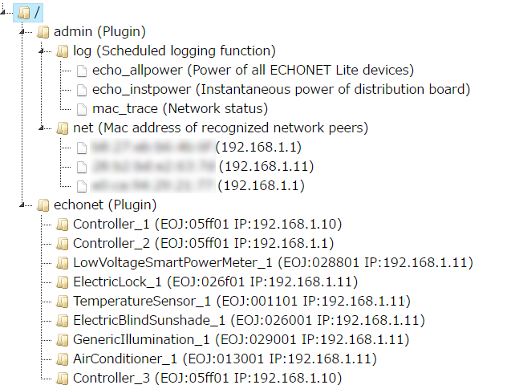

# PicoGW

[Japanese document](https://toyhack.club/picogw-jp/)

[PicoGW](https://github.com/KAIT-HEMS/node-picogw) is a [Home Automation](https://en.wikipedia.org/wiki/Home_automation) and [Building Automation](https://en.wikipedia.org/wiki/Building_automation) devices gateway server, developed by [Kanagawa Institute of Technology, Smart House Research Center](http://sh-center.org/en/), released under [MIT license](https://opensource.org/licenses/mit-license.php).
PicoGW converts protocols between device-specific ones and our REST/WebSocket API.

Since this is implemented by simple node.js, it works on various unix-based platforms including Linux, MacOS, Windows (using Bash on Ubuntu on Windows), Android (using [Termux](https://play.google.com/store/apps/details?id=com.termux)), and FreeBSD.

<font color='red'>The [old repository](https://github.com/KAIT-HEMS/PicoGW) will remain public for a while, but not actively maintained any more. It will be deleted soon.</font>

## Installation

The following command installs PicoGW and all necessary plugins, with one addition of echonet lite plugin.

```bash
$ npm install -g picogw
```

Note that **a part of our system prefers npm global install be executed without sudo**. For this reason, we strongly recommend to use [nvm (Node Version Manager)](https://github.com/creationix/nvm) to install node.

Other plugins installation

```bash
$ npm install -g picogw-plugin-XXXX
```

XXXX : plugin name.

## Running

```bash
$ picogw
```

with API port number

```bash
$ picogw -p 12345 
```

By default, dynamic files are written into **~/.picogw** directory. If you want to change the directory, copy **config.json.sample** to **config.json** and modify the ingredient. config.json is read from picogw root directory by default. if you want to load from the different location, you can also specify the path by picogw argument.

```bash
$ picogw -c /path/to/config/file.json 
```

## Public plugins

+ [admin](https://www.npmjs.com/package/picogw-plugin-admin), [web](https://www.npmjs.com/package/picogw-plugin-web), [db](https://www.npmjs.com/package/picogw-plugin-db)  (mandatory, automatically installed)
+ [macro](https://www.npmjs.com/package/picogw-plugin-macro) : Runs JS codes. Automatically installed.
+ [echonet](https://www.npmjs.com/package/picogw-plugin-echonet) : [ECHONET Lite](http://echonet.jp/english/) is home automation protocol that supports more than 100 kinds of home applicances. Automatcally installed.
+ [openweathermap](https://www.npmjs.com/package/picogw-plugin-openweathermap) : [OpenWeatherMap](http://openweathermap.org/) is a weather db and forecasting API
+ [slack](https://www.npmjs.com/package/picogw-plugin-slack)
+ [healbe](https://www.npmjs.com/package/picogw-plugin-healbe) : Acccess GoBe's coud API. GoBe is a wearable device developed by [Healbe](https://healbe.com/us/).

## Documents

[Partial documents in Japanese](http://lifedesign.tech/picogw/).

[How to develop your own PicoGW plugin](PluginDevelopment.jp.md) in Japanese.
No English documents yet..sorry.

## Remarks

+ Even if your Linux has multiple network interfaces, ECHONET Lite communication is available for only one of them. It is because [NetworkManager](https://wiki.gnome.org/Projects/NetworkManager) (the tool we use to setup network configuration) sets only one default gateway (which is used for ECHONET Lite multicasting) per machine. By default, NetworkManager sets wired Ethernet as the default gateway network interface. If no wired ethernet connection is available, wlan0 (or other wireless network) will become the default.

# Web API

The Web API hosted by PicoGW is a developing version of [Housing API by Daiwa House Industry.](http://www.daiwahouse.co.jp/lab/HousingAPI/) The API design is mainly done by [Shigeru Owada@Kanagawa Instuitute of Technology](https://github.com/sowd). If you have any criticisms, requests, or questions, please feel free to post your opinion to the [Issues page](https://github.com/KAIT-HEMS/PicoGW/issues).

## Design concept

The concept of this API is as follows:

1. **Simple and easy**. The API basecally follows the concept of REST. At the same time, we tried not to be too strict to the concept. The API can violate the conceptual correctness to achieve easiness. For example, our PubSub model is implemented as a new method of REST.
2. **Extensible**. The API should support the forthcoming IoT devices without drastically changing the basic calling styles. We adopt plugin architecture to achieve this.
3. **Independent from device-specific operations**. This is our goal. /v1/ API is really device-dependent, but we try to develop /v2/ API as device-independent one.

## Calling convention

The API call is a simple HTTP access to the PicoGW server's 8080 port by default. The result is always given as a JSON object. Most APIs exist under **/v1/** (The root **/** access shows the control panel.)

## API directory

The API has a directory structure as follows. The directories right under root (admin / echonet) are the name of plugins. This can increase if new plugin is added to the system.



The structures under a plugin name is a responsibility of the plugin. However, each subdirectory API follows the rule that the resulting JSON object contains further subdirectory name or leaf node name (which is associated with a function).


## PubSub

Connection-based API transports (named pipe and websocket) support PubSub model.

#### Subscribe
Send the following JSON to the transport. (wildcard is not supported now)

> {"method":"SUB","path":"/v1/echonet/airConditioner_1/operatingstate"}

Then a value change is asynchronously notified by a PUB JSON object.

#### Unsubscribe

> {"method":"UNSUB","path":"/v1/echonet/airconditioner_1/operatingstate"}

## API payloads

API payloads are defined by each plugin. Please refer to each plugin's README.

## Licenses

#### MIT

**Browser**  
[JSON Editor](https://github.com/jdorn/json-editor)  
[jsTree](https://www.jstree.com/)  
[jQuery](https://jquery.com/)  
[jQuery UI](https://jqueryui.com/)  
[marked](https://github.com/chjj/marked)  
[spin.js](http://spin.js.org/)  
  
**npm**  
[arped](https://www.npmjs.com/package/arped)  
[body-parser](https://www.npmjs.com/package/body-parser)  
[botkit](https://www.npmjs.com/package/botkit)  
[echonet-lite](https://www.npmjs.com/package/echonet-lite)  
[express](https://www.npmjs.com/package/express)  
[inpath](https://www.npmjs.com/package/inpath)  
[ipmask](https://www.npmjs.com/package/ipmask)  
[mime](https://www.npmjs.com/package/mime)  
[node-localstorage](https://www.npmjs.com/package/node-localstorage)  
[opts](https://www.npmjs.com/package/opts)  
[pidof](https://www.npmjs.com/package/pidof)  
[ping](https://www.npmjs.com/package/ping)  
[read](https://www.npmjs.com/package/read)  
[sudo](https://github.com/calmh/node-sudo)  

#### Apache 2

**npm**  
[websocket](https://www.npmjs.com/package/websocket)  

#### No license

[cryptico](https://www.npmjs.com/package/cryptico)  
