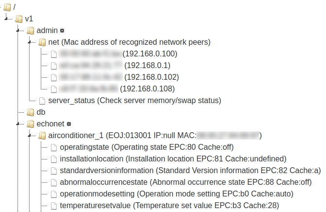

# PicoGW

[PicoGW](https://github.com/KAIT-HEMS/node-picogw) is a [Home Automation](https://en.wikipedia.org/wiki/Home_automation) and [Building Automation](https://en.wikipedia.org/wiki/Building_automation) devices gateway server, developed by [Kanagawa Institute of Technology, Smart House Research Center](http://sh-center.org/en/), released under [MIT license](https://opensource.org/licenses/mit-license.php).
PicoGW converts protocols between device-specific ones and our REST/WebSocket API.

Since this is implemented by simple node.js, it works on various unix-based platforms including Linux, MacOS, Windows (using Bash on Ubuntu on Windows), Android (using [Termux](https://play.google.com/store/apps/details?id=com.termux)).

<font color='red'>The [old repository](https://github.com/KAIT-HEMS/PicoGW) will remain public for a while, but not actively maintained any more. It will be deleted soon.</font>

## Installation

The following command installs PicoGW and all necessary plugins, with one addition of echonet lite plugin.

```bash
$ npm install -g picogw
```

Note that **a part of our system requires npm global install be executed without sudo**. For this reason, we strongly recommend to use [nvm (Node Version Manager)](https://github.com/creationix/nvm) to install node.


Other plugins installation

```bash
$ npm install -g picogw-plugin-XXXX
```

XXXX : plugin name.

## Public plugins

+ admin, web, db  (mandatory, automatically installed)
+ echonet : [ECHONET Lite](http://echonet.jp/english/) is home automation protocol that supports more than 100 kinds of home applicances. Automatcally installed.
+ openweathermap : [OpenWeatherMap](http://openweathermap.org/) is a weather db and forecasting API
+ slack
+ healbe

## Documents

[Partial documents in Japanese](http://lifedesign.tech/picogw/).
No English documents yet..sorry.

## Remarks

+ Even if your Linux has multiple network interfaces, ECHONET Lite communication is available for only one of them. It is because [NetworkManager](https://wiki.gnome.org/Projects/NetworkManager) (the tool we use to setup network configuration) sets only one default gateway (which is used for ECHONET Lite multicasting) per machine. By default, NetworkManager sets wired Ethernet as the default gateway network interface. If no wired ethernet connection is available, wlan0 (or other wireless network) will become the default.

# Web API

The Web API hosted by PicoGW is a developing version of [Housing API by Daiwa House Industry.](http://www.daiwahouse.co.jp/lab/HousingAPI/) The API design is mainly done by [Shigeru Owada@Kanagawa Instuitute of Technology](https://github.com/sowd). If you have any criticisms, requests, or questions, please feel free to post your opinion to the [Issues page](https://github.com/KAIT-HEMS/PicoGW/issues).

## Design concept

The concept of this API is as follows:

1. **Simple and easy**. The API basecally follows the concept of REST. At the same time, we tried not to be too strict to the concept. The API can violate the conceptual correctness to achieve easiness. For example, our PubSub model is implemented as a new method of REST.
2. **Extensible**. The API should support the forthcoming IoT devices without drastically changing the basic calling styles. We adopt plugin architecture to achieve this.
3. **Independent from device-specific operations**. This is our goal. /v1/ API is really device-dependent, but we try to develop /v2/ API as device-independent one.

## Calling convention

The API call is a simple HTTP access to the PicoGW server's 8080 port by default. The result is always given as a JSON object. Most APIs exist under **/v1/** (The root **/** access shows the control panel.)

# API directory

The API has a directory structure as follows. The directories right under root (admin / echonet) are the name of plugins. This can increase if new plugin is added to the system.



The structures under a plugin name is a responsibility of the plugin. However, each subdirectory API follows the rule that the resulting JSON object contains further subdirectory name or leaf node name (which is associated with a function).

## Admin Plugin

### GET /v1/admin

Admin plugin root. Currently, the admin plugin is responsible to network and server management.

#### GET /v1/admin/net

The network object in the admin plugin.

This object monitors ARP table and associates IP address with the MAC address to detact change of IP address. PicoGW currently only support IPv4 network. Internally, the detected MAC address is exposed to other plugin to trace devices.

#### GET /v1/admin/server_status

Runs 'vmstat' command to monitor server memory and other statuses.

## ECHONET Lite Plugin

### GET /v1/echonet
This path is the ECHONET Lite plugin root.
The API call returns ECHONET Lite devices ID (internally generated unique ID) with their MAC address and current IP address.

#### GET /v1/echonet/[DeviceID]
ECHONET Lite device object.
[DeviceID] is the unique name of ECHONET Lite device. This call returns ECHONET Lite device's Property IDs (EPC) and its cached value (if exists), and whether the property only exists in the super class (see ECHONET Lite specification). Example call result is :


#### GET /v1/echonet/[DeviceID]/[PropertyID]

GET access to the ECHONET Lite property.
This API will send GET request to a ECHONET Lite device and wait until the result is obtained. The API will return error if preset timeout time has past (30 seconds)
If a vaild value is obtained, the value is stored in the device's cache.

#### PUT /v1/echonet/[DeviceID]/[PropertyID]
This will set a new value (EDT) to the property. Thew new value is specified in the body text as a JSON object:

>{"value":NEWVAL}

You can also specify the ECHONET Lite binary array directly.

>{"edt":[48]}

This request header must contain "Content-type: application/json".  

There are several kinds of NEWVALs specify-able, depending on the definition. For example, OperatingState accepts the string "**on**" or "**off**", while air-conditioner's TemperatureSetValue accepts the temperature value as a number directly. The complete list of available values is in v1/plugins/echonet/proc_converter.js (See also all_Body.json to correspond ECHONET ID number to PicoGW name.)  

**edt** field only accepts the array of decimal digit such as **[48]**.

#### GET /v1/echonet/[REGEXP]/[PropertyID]

ECHONET Lite plugin supports regular expression for device names. For example:

> PUT http://192.168.1.10:8080/v1/echonet/.+/OperatingState/

with the body text as {"value":"0x30"} will set 0x30 to all existing devices's OperatingState.

> GET http://192.168.1.10:8080/v1/echonet/(GenericIllumination_1|AirConditioner_1)/OperatingState/

will obtain OperatingState of a light and an airconditioner at once. Note that the response time is dominated by the slowest device.

PropertyID cannot accept regular expression (because it can easily be many!)

## Slack Plugin

Slack plugin works after the bot token is specified to the settings. The token can be generated by:

1. Log in to your slack team in your browser.
2. Access **https://[Your Team].slack.com/apps/A0F7YS25R-bots**
3. Click 'Add Configuration' link
4. Set bot name (We recommend 'nanogw-[NanoGW Place]') and click 'Add Bot Integration'
5. The token is shown in Integration Settings => API Token. Copy-paste it to NanoGW plugin's setting.
6. Add this bot to your favorite channel(s).

### GET|POST /v1/slack/post
with the parameter **text** to post to slack

### SUB /v1/slack/[free string]

If there is a mention or a private message to this bot, the first word is recognized as a command and any following string becomes the parameter.  
For example, if the API client subscribes **/v1/slack/hello**, a string is published when there is a mention such as **@nanogw-bot hello slack!**

## Database Plugin

Database plugin provides an API for simple key-value database within GW.
The (arbitrary ) path becomes the key of the data.
Also, the source code of database plugin is a good example of basic plugin implementation. If you want to develop your own plugin, please refer to v1/plugins/db/index.js.

#### GET /v1/db

List of all stored keys.

#### GET /v1/db/[PATH_AS_A_KEY]

returns the stored value.

#### PUT|POST /v1/db/[PATH_AS_A_KEY]

Stores a value (specified in the body). The value should be in JSON format. It is stringified before stored. The written value is published from the specified path using PubSub.

#### DELETE /v1/db/[PATH_AS_A_KEY]

Deletes the key and the corresponding data. Publishes {}.

#### DELETE /v1/db

Deletes all data. (/v1/db path remains.)

## Named pipe API

Named pipe can be used as a transport of PicoGW API. It is convenient to access PicoGW's functionality within a single machine. To use this API, please first make two named piped files (by the **mkfifo** command), which must have the unique prefix with two kinds of postfices (_r and _w). For example :

```bash
$ mkfifo np_r np_w
```
will create a pair of named pipes. *np* in the example above can be an arbitrary vaild string.
Then, PicoGW must be launched with **--pipe** option supplied with unique prefix:
```bash
$ node main.js --pipe np
```
In this mode, PicoGW will halt until the client that accesses the named pipe is connected. The client must open *_r* file with read only mode, while *_w* with write mode.

The API call should be written to *_w* file as a string followed by a newline "\n". The string is a stringified JSON object such as:

```
{"method":"GET","path":"/v1/echonet/AirConditioner_1/OperatingState/","tid":"RANDOM_STR"}
```
**tid** is the transaction id of the request, which is used to match request and reply (multiple request causes unordered reply.)  
To set a new value:
```
{"method":"PUT","path":"/v1/echonet/AirConditioner_1/OperatingState/","args":{"value":["0x30"]},"tid":"RANDOM_STR"}
```
For PUT case, **args** key is necessary.
Make sure that this request itself must not contain a newline "\n".

The API result can be obtained from reading the *_r* file.

## PubSub

Connection-based API transports (named pipe and websocket) support PubSub model.

#### Subscribe
Send the following JSON to the transport. (wildcard is not supported now)

> {"method":"SUB","path":"/v1/echonet/AirConditioner_1/OperatingState"}

Then a value change is asynchronously notified by a PUB JSON object.

#### Unsubscribe

> {"method":"UNSUB","path":"/v1/echonet/AirConditioner_1/OperatingState"}

## Licenses

#### MIT

**Browser**  
[JSON Editor](https://github.com/jdorn/json-editor)  
[jsTree](https://www.jstree.com/)  
[jQuery](https://jquery.com/)  
[jQuery UI](https://jqueryui.com/)  
[marked](https://github.com/chjj/marked)  
[spin.js](http://spin.js.org/)  
  
**npm**  
[arped](https://www.npmjs.com/package/arped)  
[body-parser](https://www.npmjs.com/package/body-parser)  
[botkit](https://www.npmjs.com/package/botkit)  
[echonet-lite](https://www.npmjs.com/package/echonet-lite)  
[express](https://www.npmjs.com/package/express)  
[inpath](https://www.npmjs.com/package/inpath)  
[ipmask](https://www.npmjs.com/package/ipmask)  
[mime](https://www.npmjs.com/package/mime)  
[node-localstorage](https://www.npmjs.com/package/node-localstorage)  
[opts](https://www.npmjs.com/package/opts)  
[pidof](https://www.npmjs.com/package/pidof)  
[ping](https://www.npmjs.com/package/ping)  
[read](https://www.npmjs.com/package/read)  
[sudo](https://github.com/calmh/node-sudo)  

#### Apache 2

**npm**  
[websocket](https://www.npmjs.com/package/websocket)  
[node-red](https://www.npmjs.com/package/node-red)

#### No license

[cryptico](https://www.npmjs.com/package/cryptico)  
